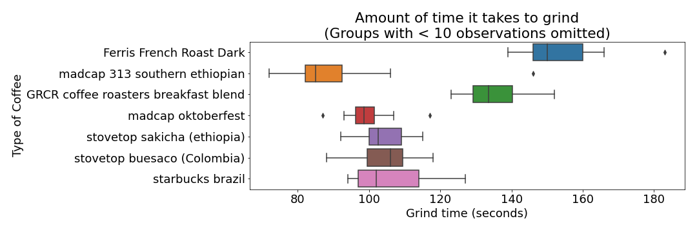
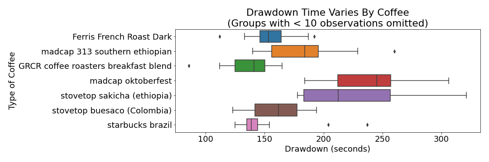

I've always wondered about the amount of time it takes me to brew coffee. Does it take me longer to make it earlier in the morning? Does it vary by the type of coffee I have? In order to answer these questions, I kept track of the amount of time it took me to make a cup of coffee. 

---

### Summary
I got faster at counting the beans, but didn't get more accurate when counting them out. Grind times were different between coffees as well as the drawdown times. On average it takes around 13 minutes to make coffee, and on average it varies by 2ish minutes. After some time value calculations I end up saving money by purchasing an electric grinder or scale.

---

### Coffee Brewing Process

The way I brew coffee looks something like this:

I start with a bag of whole bean coffee, count out 173 beans, and then grind them up using a manually cranked coffee grinder. Hot water is poured over ground coffee beans and the water passes through and into some sort of vessel. This process gave me quite a few things I could keep track of:

- Count Time: Time to count out the beans 
- Grind Time: Time to grind the beans manually
- Draw Down Time: Time for the water to pass through the coffee grounds
- Number of beans I was supposed to count out (need to control for this)
- Number of beans I actually poured out (I was eyeballing everything)

---

I recorded data 104 times between August 27th, 2020 and December 26th, 2020, and the below plot shows the total amount of time the coffee brewing process took each day.

It took 13.3 minutes to brew a cup of coffee on average, and varies by around 2 minutes. The fastest cup took 10 minutes of make, and the longest cupt took 20 minutes to make.

---

Not all records contained all of the fields, as I didn't start recording the start / end times until 30 or 40 records in, so there is some filtering that happens when you see these visualizations. 

I used 11 different types of coffee throughout the project.

Things like brew time and grind time definitely vary by coffee, and I think this has more to do with the coffee bean shape / size / weight than anything I can control.

Maybe the grind time varies

Or the draw down time

The drawdowns do appear to vary by coffee.

---

As I started to do this consistently, I started to wonder if I was getting any faster at counting out the beans.

The first few times I got lots better, but the returns appear to be diminishing. Now I'm at less than 100.

---

I wondered the same thing with my pouring accuracy. That is, am I getting better at eyeballing 173 beans after I pour the beans out of the bag?

Doesn't look like I really improved on pouring them out, and I was way more likely to overpour than underpour. 

---

### Money Money Money

Both the time it takes me to count out the beans and the time it takes me to grind them could be reduced. But would these upgrades be worth it? For that I'll have to turn to one of my previous projects, [amisaving](https://anthonyyoskovich.com/project/amisaving/).

Tackle one at a time:
- Scale to stop counting: around $50
- Electric grinder to stop manually grinding: $200 (yes, that expensive)

I suppose at this point I'm missing something for this comparison to be possible, and that's some sort of measurement for the value of my time. If I'm going to save 15 minutes by making the purchase, I need some sort of way to value my time. I'll use my wage, which let's say is $25. The value of my hour. 

To simplify things, let's say that both of these pieces of equipment completely eliminate the time required for counting and grinding. In other words, the grinding is instant and the "counting" by weighing is instant.

- Avg count time: 2 minutes
- Avg grind time: 2 minutes

So basically, at 25 / hour, I would save 4 minutes every day, or (25/60) * 4 = $1.66. I'd start saving money after 150 uses, which is a little less than half of a year. So yeah, I think for my wallet AND my sanity it would be a good idea to invest in some technology to bring me out of the stone age.

