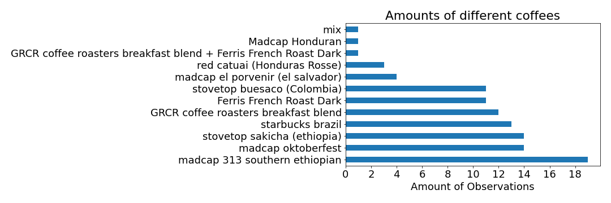
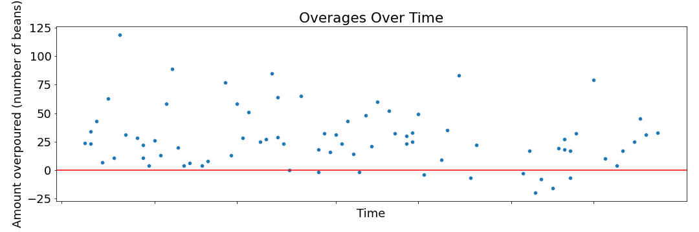

I've always wondered about the amount of time it takes me to brew coffee. Does it take me longer to make it earlier in the morning? Does it vary by the type of coffee I have? In order to answer these questions, I kept track of the amount of time it took me to make a cup of coffee. 

---

### Summary
I got faster at counting the beans, but didn't get more accurate when counting them out. Grind times were different between coffees as well as the drawdown times. On average it takes around 14 minutes to make coffee, and on average it varies by xxxxxx. Also, if I value my time at $25 / hour, I xxxxxxx save money by purchasing an electric grinder or scale.

---

Along with the type of coffee and the time of day, the main things I timed were:
- Count Time: Amount of time to count out the beans (yes, I manually do this)
- Grind Time: Amount of time to grind the beans manually
- Brew Time: Amount of time it took the water to pass through the coffee 

I also kept track of a few other things:
- Amount of beans I was supposed to count out (need to control for this)
- Amount of beans I actually poured out

---

For some context, brewing the coffee looks something like this:

In total I had around 100 data points. I was fairly consistent in making the coffee every day:

Not all records contained all of the fields, as I didn't start recording the start / end times until 30 or 40 records in, so there is some filtering that happens when you see these visualizations. 

I used 11 different types of coffee throughout the time, and only some groups had more than 10 observations.

Let's first look at the total amount of time I spent making coffee over time:

Most of the time it took me around 14ish minutes to make coffee, and I don't really see any sort of trend here. It's fairly consistent. I don't see any sort of trend to indicate that I could "skill" my way to a faster brew time.

Maybe the brew time varies by the type of coffee:

We can zoom in a bit and look at the grind time / drawdown time for each

Here is about that one.

The drawdowns do appear to vary by coffee.

---

I was also curious if I got faster at counting out the beans

The first few times I got lots better, but the returns appear to be diminishing. Now I'm at less than 100.

Or if I became any more accurate at eyeballing the pours

Doesn't look like I really improved on pouring them out, and I was way more likely to overpour than underpour.

---

### Money Money Money

Would it make sense for me to buy a scale? Would it make sense to buy an electric grinder? I'll use this data to compute the time I would save.

Avg time counting:
Avg time grinding: 

Insert my timevalue here ($25 / hour)
Use amisaving to compute the savings
