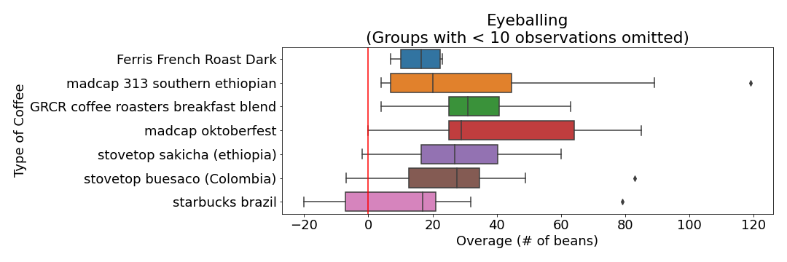

I've always wondered about the amount of time it takes me to brew a cup of coffee. In order to answer this question I recorded the amount of time it took me to make a cup of coffee every day for over 3 months.

---

### Tl;dr / Summary
On average it takes me 13 minutes to make a cup of coffee and that average varies by 2 minutes. I got faster measuring out the beans but didn't get more accurate when eyeballing the amount. The amount of time it took to grind the beans were different across coffees as well as the amount of time it took for all the water to pass through the ground beans. I'd end up saving money in less than a year if I purchased an electric grinder and scale.

---

### Coffee Brewing Process

The way I brew coffee looks something like this:

I start with a bag of whole bean coffee, count out 173 beans, and then grind them up using a manually cranked coffee grinder. I pour hot water over the coffee beans and the water passes through them into a cup. I decided to keep track of a few things throughout the coffee brewing process: 

- cTime: Time to count out the beans 
- gTime: Time to grind the beans manually
- bTime: Time for the water to pass through the coffee grounds
- count: Number of beans I was supposed to count out 
- over: Number of beans I actually poured out 
- duration: Total amount of time the cup took to make

Here's a screenshot of the data, and you can find the code [here](https://github.com/ayoskovich/coffee-log).

---

I recorded data 104 times between October 27th, 2020 and December 26th, 2020. The below plot shows the total amount of time the coffee brewing process took each day.

It took 13.3 minutes to brew a cup of coffee on average, and varies by around 2 minutes. The fastest cup took 10 minutes to make, and the longest cup took 20 minutes to make.

---

Things like brew time and grind time seem to vary by the type of coffee, but this likely has more to do with the coffee bean shape / size / weight than anything I can control.

---

As I started to record data consistently, I began to wonder if I was getting any faster at counting out the beans.

The first 20 or so times I improved quite a bit, but the gains dimished quite quickly after that. 

---

I also wondered the same thing about my pouring accuracy. In other words, am I getting better at eyeballing the number of beans I need to pour out?

Doesn't look like I really improved on pouring them out, and I was way more likely to overpour than underpour. 

The Stovetop Buesaco, Stovetop Sakicha, and Starbucks Brazil coffess were the main culprits of my underpouring.

---

## Money Money Money
I could reduce the total brewing time if I had some more electronic equipment. For example, I wouldn't have to manually count out the beans if I had a scale, and I could grind the beans almost instantly if I had an electric coffee grinder. Allow me to throw out 2 extremely rough estimates of what these tools would cost:
- Scale: around $50
- Electric grinder: $200 (yes that's 2 zeros, I need a good one...)

In order to start judging whether or not these investments are worth my money, I need some sort of measurement for the value of my time. I'd say I value 1 hour of my time at around $25. I know that with my current, no equipment setup, I'm spending at least this much time:

- Avg count time: 2 minutes
- Avg grind time: 2 minutes

By purchasing a scale and an electric grinder, I would save around 4 minutes every day.

At $25 / hour, (25/60) * 4 = $1.66. I'd save $1.66 each use. After inputting these values into my handy, custom built calculator <a href="http://www.amisaving.com" target="_blank">amisaving</a>, I'd start saving money after 150 uses, which is a little less than half of a year. 

So yeah, I think for my wallet AND my sanity it would be a good idea to invest in some technology to bring me out of the stone age.
