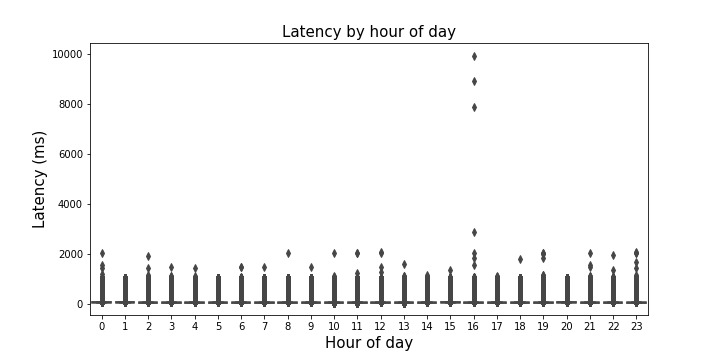
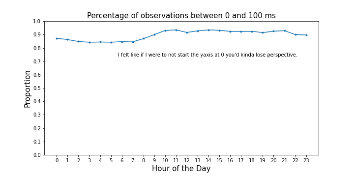
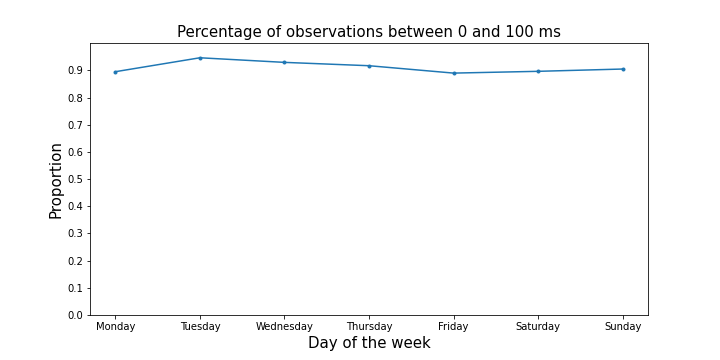

In order to analyze my internet speed I created an cron job to log the output of `ping` and `traceroute`. I'm wondering if there is a best time to browse the internet. I suppose this echoes the operations research idea of does an optimum exist, and if so, where is it? My questions were as follows:

1. Has my internet speed been changing over time?
2. When is my internet speed the most variable?
3. When is the best time for me to get on the internet?

SPOILER: There isn't a clear optimum time, and my internet speed (as I defined that) is remarkably consistent.

--- 

## Findings

Looking at the information cut by hour yields this messy image. There is major skewness overall, by hour, and also by day of the week and these patterns are consistent across all.

In an effort to see what's going on, I'll filter down to < 100 ms.

Still pretty messy, an investigation of the percentiles yields an insight. Pretty much 90% of all pings had latencies less than 100ms. My total sample size is 894,039. 

I'll go out on a limb and say that we'll start approaching a "noticeable" difference at around the 1/2 second mark or 500ms. Of all the observations, that happens ~ 7% of the time.

--- 

## Onward
Maybe instead of just pinging google.com, simulate an average day on the computer for me, using my internet history. The resulting consistency doesn't really mean that I'm experiencing a constant speed on the internet, another explanation might be that the traffic is being routed the exact same and google is just really consistent.

