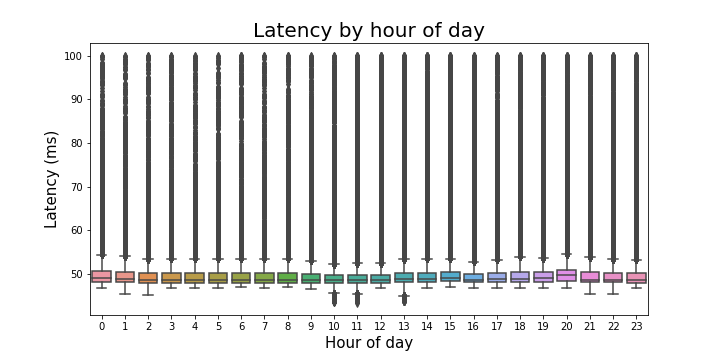

Over the course of a month, I created a cron job to log the output of `ping` in order to analyze my internet latency to `google.com`. Is there a "fastest" time to go to google.com? And if this magical time does exist, when is it?

--- 

__SPOILER__: The magical time of fast internet doesn't seem to exist, and my latency is remarkably consistent (< 1/10th of a second 90% of the time).

---

I was logging data every time my computer was on, and I had around 60,000 observations per day with quite a bit of variability.

--- 

Here's what the raw data looked like by hour:

The red line is drawn at 1000 ms (1 second), and it's immediately noticeable that there is a lot of skewness. Even when limiting the data to measurements less than 100ms, the skewness exists.

Still not pretty but at least the box part of the box plots are visible now! The 1000 fastest times occurred 10am, 11am, and 1pm of 2 consecutive days.

---

### Are some hours more skewed than others? 
 

I'd say anything more than 500ms is going to be noticeable, and by that definition the latency to google.com is only going to be "slow" around 5% of the time.

--- 

### What do these slow pings have in common?

After computing the within hour proportion of pings greater than 500ms, no clear pattern jumps out. There appears to be a slight difference between hours 0 - 8, and the rest of the day, but it'd be a stretch to say any of that would be practically noticeable. 

--- 

## Onward

I didn't find any shocking results here, apart from learning that my latency is quite consistent over time. It was a fun project learning to automate things and dealing with the output.

This is part 1 of who knows how many parts. In part 2 I'll integrate the traceroute information, as I suspect that the slow speeds may have something to do with the route the packet takes. 

Also, from an inferential perspective I can't really say that the data I used is representative of the internet speed that I experience in a normal day. After all, I go to other sites than google.com. Simulating a "normal day" using my internet history and ping rather than just pinging google.com might score me some points in that direction, though.

---

Thanks for reading! If you're interested in the code I used for this project, the github repo is [here](https://github.com/ayoskovich/int-traffic).

