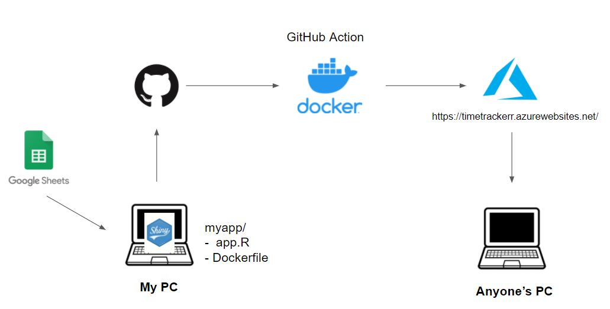

  <a href="https://timetrackerr.azurewebsites.net/" target="_blank">
    View the dashboard here
  </a>

I've been keeping track of the time I spend focusing on tasks for almost a year now. In an effort to do more strategic and intentional work, my process has been:

1. Decide on a task to work on
2. Set a timer for a certain amount of time
3. Work on *__only__* that task for the set amount of time

The data I'm gathering looks like this:

| Date      | Task | Minutes
| ---------- | ----------- | --- |
| 2/2/2022   | Style Personal Website | 15 |
| 2/3/2022   | Some other task | 30 |
| ... | ... | ... |

I've built this dashboard so I could answer the following questions:

- Was I more productive this week or last week?
- Am I improving my ability to focus for long periods of time?
- What have I been spending most of my time on recently?

It's been nice to have a simple web interface for this instead of having to boot up R Studio and build the app.

## Technical Outline

Here's what the whole thing looks like in terms of tech:

The actual app and Dockerfile live in a github repo (that pulls from a private google sheet), and I use a github action to deploy the container to Azure. I am using a private google sheet for obvious reasons but I would have liked to be able to publicly share the code. However, I haven't been able to figure out how to integrate either some sort of github secret or environment variable to store the project key (on the google side) to authenticate the connection to gather the data.

Final side note, when pulling data from a google sheet, the sheet must be shared with the email address of the service account. I kept getting some error about insufficient privileges without doing that.

